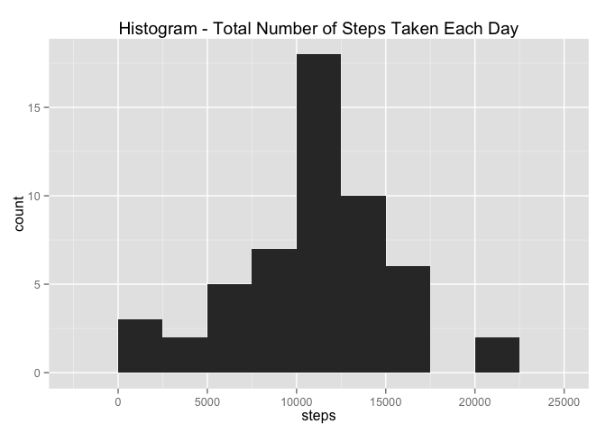
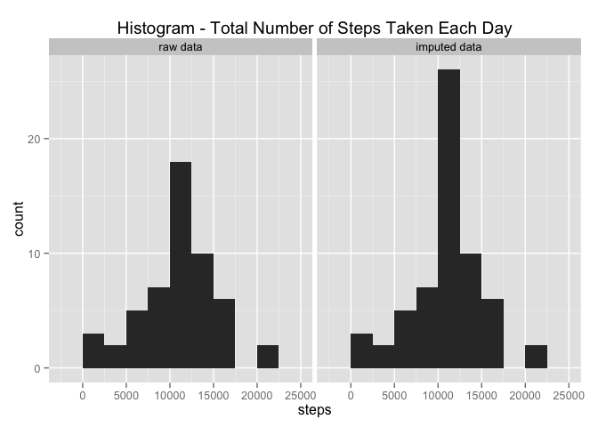
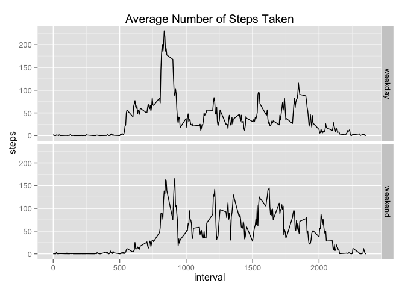

# Reproducible Research: Peer Assessment 1


## Loading and preprocessing the data

```r
unzip("activity.zip")
df <- read.csv("activity.csv")
summary(df)
```

```
##      steps               date          interval   
##  Min.   :  0.0   2012-10-01:  288   Min.   :   0  
##  1st Qu.:  0.0   2012-10-02:  288   1st Qu.: 589  
##  Median :  0.0   2012-10-03:  288   Median :1178  
##  Mean   : 37.4   2012-10-04:  288   Mean   :1178  
##  3rd Qu.: 12.0   2012-10-05:  288   3rd Qu.:1766  
##  Max.   :806.0   2012-10-06:  288   Max.   :2355  
##  NA's   :2304    (Other)   :15840
```

## What is mean total number of steps taken per day?

Histogram of the total number of steps taken each day

```r
df.total <- aggregate(steps~date, data=df, sum)
require(ggplot2)
```

```
## Loading required package: ggplot2
```

```r
# hist(df.total$steps, xlab="Number of Steps",
#      main="Histogram - Total Number of Steps Taken Each Day")
qplot(steps, data=df.total, geom="histogram", binwidth=2500,
      main="Histogram - Total Number of Steps Taken Each Day")
```

 

Mean and median total number of steps taken per day

```r
summary(df.total$steps)[c("Mean", "Median")]
```

```
##   Mean Median 
##  10800  10800
```

## What is the average daily activity pattern?
Time series plot (i.e. type = "l") of the 5-minute interval (x-axis) and the average number of steps taken, averaged across all days (y-axis)

```r
df.avg <- aggregate(steps~interval, data=df, mean)
# plot(df.avg$interval, df.avg$steps, type="l", xlab="interval", ylab="steps",
#      main="Average Number of Steps Taken")
qplot(interval, steps, data=df.avg, geom="line",
      main="Average Number of Steps Taken")
```

 

The 5-minute interval on average across all the days in the dataset, contains the maximum number of steps

```r
df.avg[which.max(df.avg$steps), "interval"]
```

```
## [1] 835
```

## Imputing missing values
Total number of rows with NAs

```r
sum(rowSums(is.na(df))>0)
```

```
## [1] 2304
```

Fill the NAs with the mean for that 5-minute interval

```r
dfx <- df #[,c("steps", "interval")]
dfxx <- merge(dfx, df.avg, by="interval", all.x=T, sort=F)
lst.na.rows <- is.na(dfxx$steps.x)
dfxx[lst.na.rows, "steps.x"] <- dfxx[lst.na.rows, "steps.y"]
dfxx <- dfxx[,c("steps.x", "date", "interval")]
names(dfxx) <- c("steps", "date", "interval")
df.new <- merge(dfx[,c("interval", "date")], dfxx,
             by=c("date", "interval"), all.x=T, sort=F)
```

### Using new dataset and benchmark with raw dataset
Histogram of the total number of steps taken each day

```r
df.total.new <- aggregate(steps~date, data=df.new, sum)
# hist(df.new.total$steps, xlab="Number of Steps",
#      main="Histogram - Total Number of Steps Taken Each Day")
df.total.all <- rbind(cbind(df.total, data.frame(type="raw data")),
                      cbind(df.total.new, data.frame(type="imputed data")))
qplot(steps, data=df.total.all, geom="histogram", facets=~type, binwidth=2500,
      main="Histogram - Total Number of Steps Taken Each Day")
```

 

It is obvious that the central bin has higher probability now after filling NAs. We are filling them with mean for that 5-minute interval, thus it is more likely in the central bin.


Mean and median total number of steps taken per day

```r
summary(df.total.new$steps)[c("Mean", "Median")]
```

```
##   Mean Median 
##  10800  10800
```

The mean and median are the same.

## Are there differences in activity patterns between weekdays and weekends?

```r
# df.avg.new <- aggregate(steps~date+interval, data=df.new, mean)
lst.is.weekend <- weekdays(as.Date(df.new$date)) %in% c("Saturday", "Sunday")
df.new[lst.is.weekend, "day"] <- "weekend"
df.new[!lst.is.weekend, "day"] <- "weekday"
qplot(interval, steps, data=df.new, geom="line", facets=day~., 
      stat="summary", fun.y="mean",
      main="Average Number of Steps Taken")
```

 

It is apparent from the plot that during weekends, 

- People wake up late and sleep late
- People are less active in the morning while more in the afternoon
- People are more relaxed in the evenings
